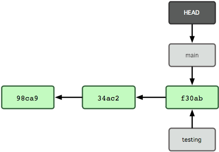

# Title
### Subheading

Notes: Examples notes

---

## Quote and Picture

> Important quote here 



---

## Point 1 -> Subpoint A

* Subpoint
* Subpoint

Notes: Remmeber to say something funny here...

------

## Point 1 -> Subpoint B

Hello point 1, subpoint b

---

## Point 2

These bullets appear one at a time

* Fragment a <!-- .element: class="fragment" data-fragment-index="1" -->
* Fragment b <!-- .element: class="fragment" data-fragment-index="2" -->

---

<!-- .slide: data-background="#81ceff" -->
## Point 3

* This slide is a different color!

---

<!-- .slide: data-background-image="images/bg_basics.png" -->
## Point 4

* This slide has a background

---

## Code

Describe the problem here...

```python
import pandas as pd
df = pd.DataFrame(my_table)
dt.to_csv()
```

And now to something completely different.

